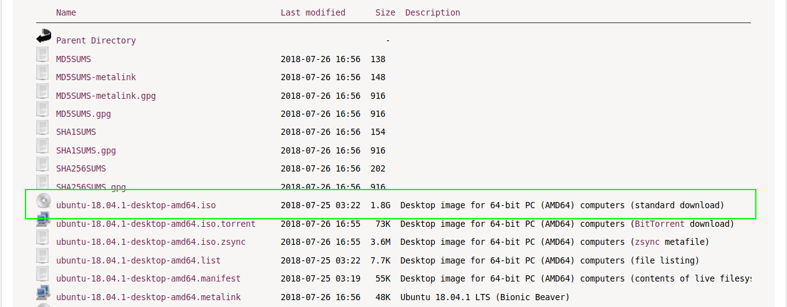
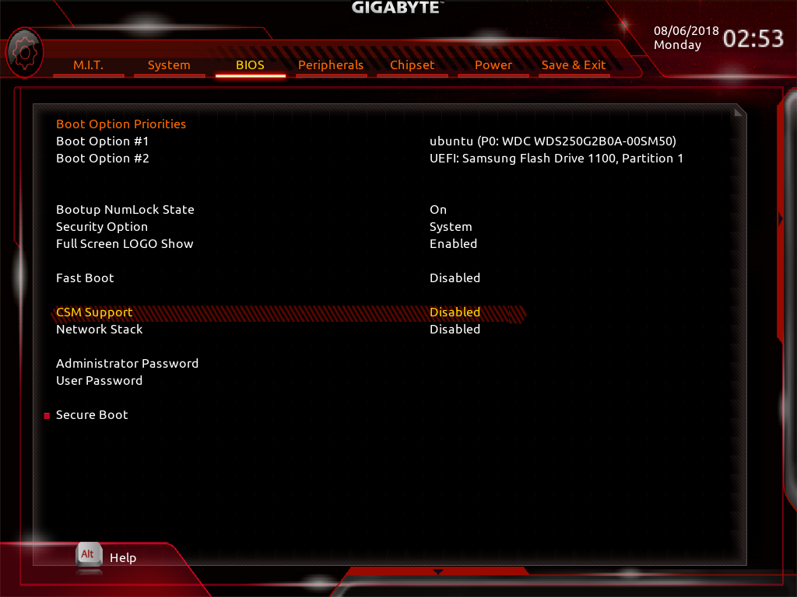
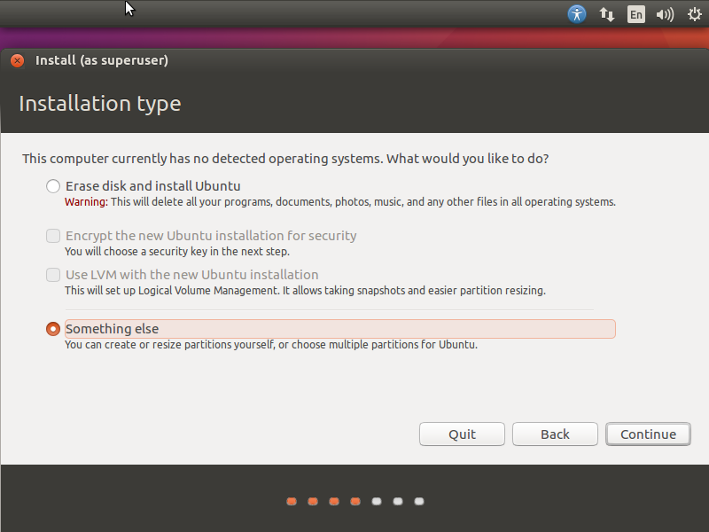
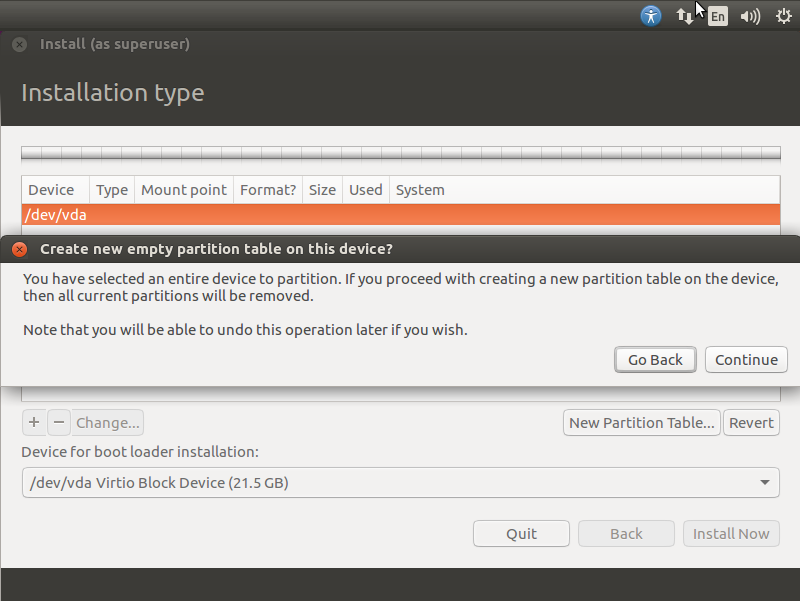
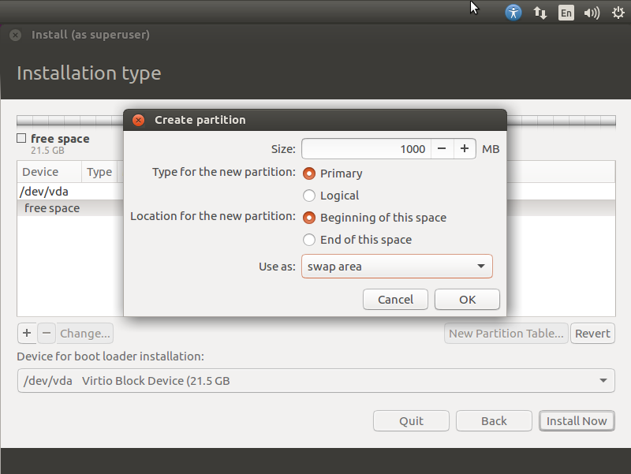
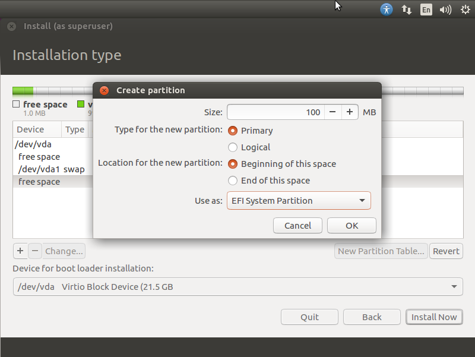
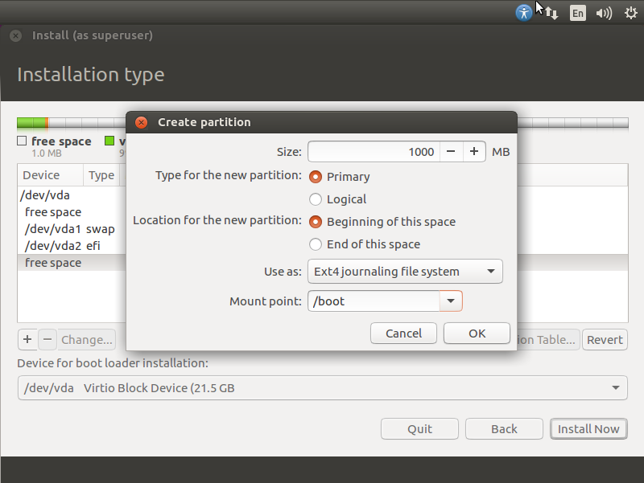
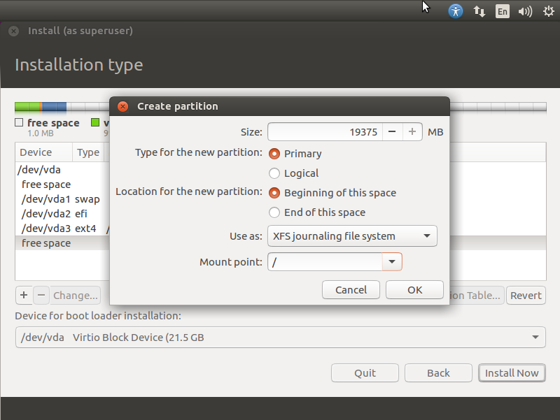
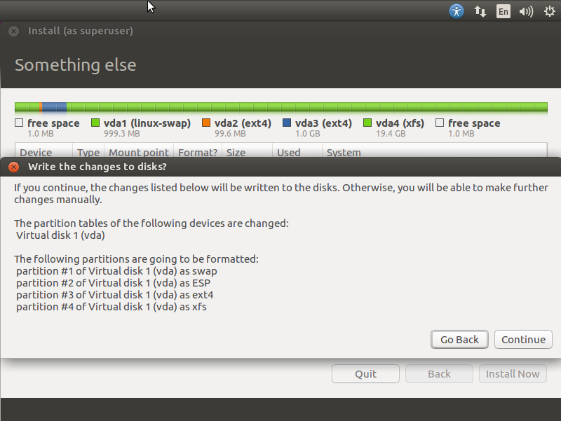

# DevOpsBroker Ubuntu 18.04 Desktop Configurator

The DevOpsBroker Ubuntu 18.04 Desktop Configurator is a complete turn-key solution for configuring a fresh installation of Ubuntu 18.04 Desktop.

The following tasks are performed by the Configurator:

- Configures IPv4 firewall and IPv6 firewall using iptables and ip6tables
- Installs all DevOpsBroker system administration and user utilities
- Installs a number of useful applications, libraries and utilities
- Installs any available proprietary drivers
- Configures and optimizes the file system
- Performs Linux kernel tuning optimizations
- Performs general system configuration
- Configures the fastest APT sources mirror
- Configures and optimizes GRUB
- Manages DevOpsBroker configuration files (e.g. ansi.conf)
- Tunes the default network interface card
- Performs Samba configuration and optimization
- Configures systemwide security configuration
- Configures the Disk I/O schedulers and tunes each disk independently
- Replaces dnsmasq with unbound for the local DNS cache server
- Performs user configuration

## Install Ubuntu 18.04 Desktop

### Download Ubuntu 18.04 Desktop

First thing to do is download and install a fresh copy of Ubuntu 18.04 Desktop. The latest ISO images can be found at:

[Ubuntu 18.04 Bionic Beaver Downloads](http://releases.ubuntu.com/18.04/)

Download the 64-bit ISO image to take full advantage of the hardware inside your PC or laptop. Save the ISO file to the Downloads directory.

### Create Bootable USB Drive

For each scenario below, you will need:
- A 2GB or larger USB drive
- The Ubuntu 18.04 Desktop ISO file

#### From Windows

1. Download [Rufus](https://rufus.akeo.ie/), a free and open-source tool to create bootable USB drives
2. Launch Rufus
   * Insert USB drive
   * Select USB drive in the Device field
   * Boot Selection
     - Select the Ubuntu 18.04 Desktop ISO file
   * Partition Scheme
     - Select **MBR**
   * Target System
     - Select **BIOS or UEFI**
   * Click **Start**

Once Rufus completes the ISO image writing process, you can now install Ubuntu 18.04 Desktop from the USB drive.

#### From Ubuntu

1. Insert USB drive
2. Launch Starup Disk Creator
   * Search for 'Startup Disk Creator' from either **Activities** or **Show Applications**
3. Select the Ubuntu 18.04 Desktop ISO file
4. Select the USB drive
5. Click **Make Startup Disk**
6. Confirm the USB drive chosen is correct

Once Startup Disk Creator completes the ISO image writing process, you can now install Ubuntu 18.04 Desktop from the USB drive.

### Enable UEFI Boot in BIOS

Again, in order to take full advantage of your machine hardware, you will want to enable UEFI booting before installing Ubuntu.

Every manufacturer is different when it comes to enabling UEFI booting in BIOS. For instance, on my Gigabyte motherboard, I must **disable** CSM Support in order to enable UEFI booting.

Check the motherboard documentation to find the specifics on enabling UEFI booting for your machine.

### EFI System Partition Configuration

The EFI booting architecture requires a specialized partition configuration in order to work properly.

1. Create a custom partition scheme from **Installation type**
   * Choose **Something else** from the Installation type menu

2. Create an empty partition table (**WARNING: Will erase everything on the disk**)
   * Click on the **New Parition Table...** button and then select **Continue**

3. Create a swap partition
   * Click on the **+** button and then configure with the appropriate size for your machine

4. Create an EFI System partition
   * A 100MB partition size is more than sufficient

5. Create a /boot partition
   * Make 1000MB partition size with ext4 file system

6. Create a /dropbox partition (**Optional**)
   * If you are a Dropbox user, you will need to create a separate partition for your Dropbox folder
   * From the infinite wisdom of Dropbox: "[**On Nov. 7, 2018, we’re ending support for Dropbox syncing to drives with certain uncommon file systems.** The supported file systems are NTFS for Windows, HFS+ or APFS for Mac, and **Ext4 for Linux**](https://www.dropboxforum.com/t5/Syncing-and-uploads/Dropbox-client-warns-me-that-it-ll-stop-syncing-in-Nov-why/m-p/290065/highlight/true#M42255)"
   * Create an unencrypted Ext4 partition mounted to the /dropbox folder sized appropriately for your specific needs

7. Create the / partition
   * Use the rest of the disk for the root partition size with the XFS file system

8. Write all changes to disk
   * Click on **Install Now** button and then select **Continue**

